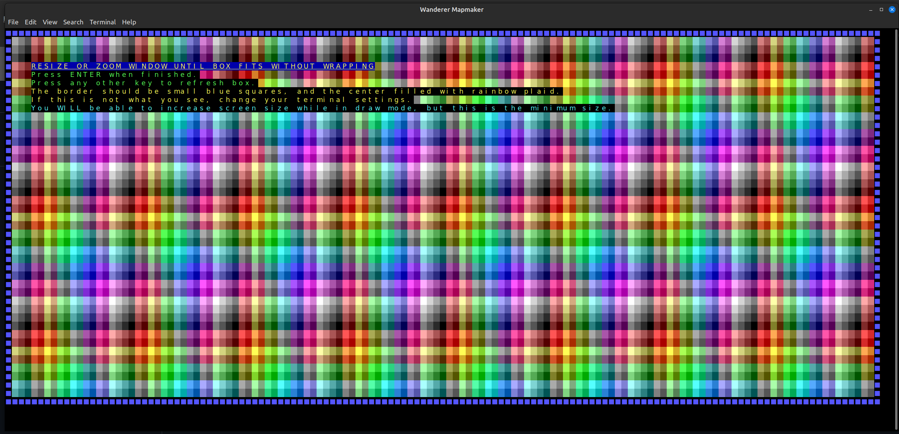
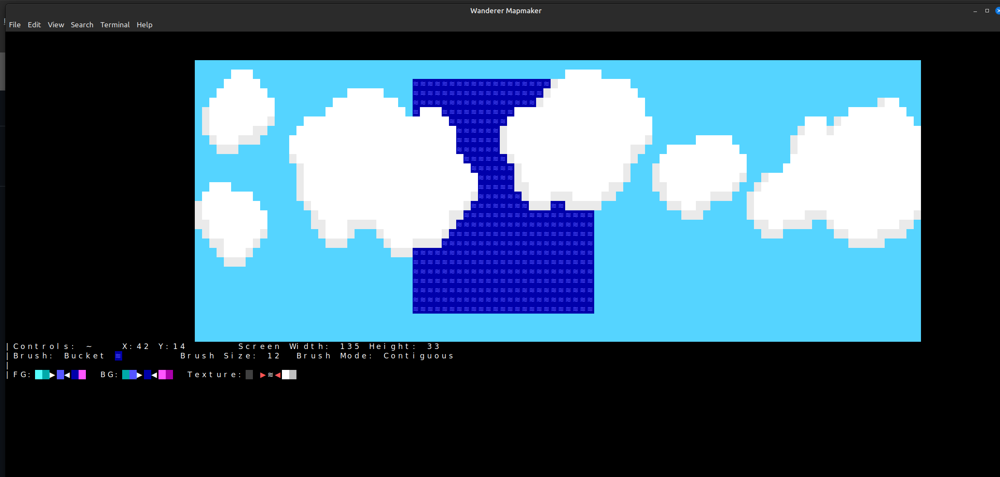

# Building the Project:
The project requires the GCC compiler and at least C++23 (due to the use of std::filesystem and some other features).

## Linux
Run 'make' from the Wanderer/Source directory; either "make debug" or "make release" to specify the optimization level. You may also add "clean" to the command to automatically delete the compiled executable on exit.
I've tested it on a clean version of Linux Mint, but I cannot guarantee compatibility with non-Ubuntu distros or Weyland-based systems.

## Manual
To manually compile it without makefile, compile Wanderer/Source/wandererMapMaker.cpp using at least the -std=c++23 tag. Other tags should not be necessary, as I've tested it to work fine without them, but using the ones in the makefile is still preferred. The wotjcore and Wanderer libraries are all statically linked to that main file directly or indirectly. 

# Tips and Controls:
After entering the Main Menu, press 1 to enter Paint Mode. View additional controls by pressing ~.

Use the arrow keys to move around, the number keys to select a brush, and / to change between different modes of the brush.

Use ,. to navigate the tileset, and the [] and ;' keys to change colors.

Tileset can be changed from the Main Menu, which is accessible in Paint Mode by pressing TAB.

Ctrl+Z and Ctrl+Y work as expected.

Screen can be resized using PgUp and PgDn, but you will likely have to resize and refresh the screen (applying a brush or entering a menu will manually refresh it).

Additional functionality, such as saving/loading, rotating and resizing the canvas, etc., can be found on the Main Menu.

# About the project:
This tool is not intended to represent the game runtime, rather just modify its assets. It will not have the same architecture or rendering backend as the game itself (aside from wotjcore), such as realtime animations or map cells. It's written in a more C-style way mostly just for practice, but also because it seemed a bit overcomplicated to use OOP game state for something like this; actual in-engine editing will be done with an in-game editor as an all-in-one package.

The overall goal of this RPG project is to familiarize myself with C++ and game programming. As such, I have no plans to implement square pixels (using the Upper Half Block trick), character sprites, or complex graphics, though I do wish to explore very simple animations. It will also be a platform to experiment with procedural generation, but none of that is included here. Each entity (called 'activators' in the code) will be a single screen character, and the terrain will be half-procedurally-generated, with pre-built structures and features being loaded in as needed. It will have a pathfinding/height map layer, though the exact nature of it is still open to experimentation.
